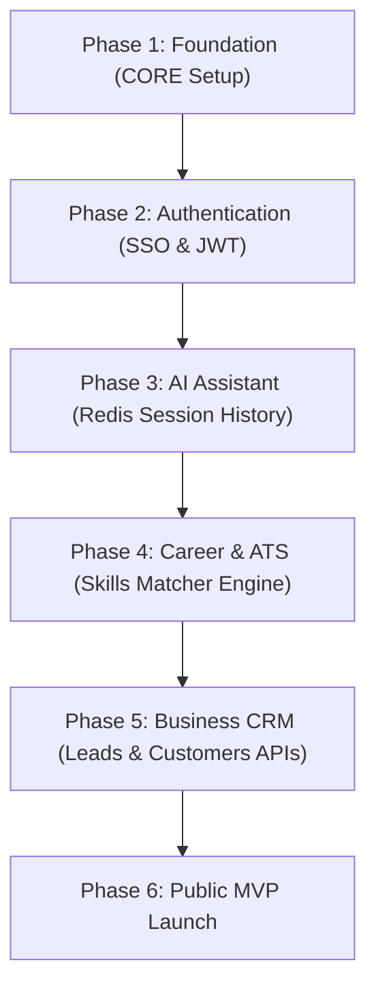

# 📘 Handbook 01 – Business & Product

**Version:** 1.0  
**Owner:** Founder / Product Manager  
**Scope:** Strategy, Modules, Personas, Pricing, and Roadmap  

---

## 2.1 Product Vision

### JovianeX: The Autonomous AI Enterprise Ecosystem

JovianeX is an enterprise-grade AI-native ecosystem designed to automate and orchestrate modern organizational workflows. By coupling natural language intents directly to executable capabilities, JovianeX eliminates the friction between business operations and core digital services.

* **Target Issues Solved:**
  - High friction in candidate matching and recruitment workflow operations.
  - Fragmented and disconnected CRM, career platform, and payment portals.
  - Absence of a centralized, secure natural language gateway for executing cross-module operations.
* **Long-Term Vision:**
  - Standardize autonomous AI agent orchestrations for recruitment, business resources scheduling, and logistics, scaling from individual freelancers to enterprise conglomerates.

---

## 2.2 Product Strategy

JovianeX progresses through a phased deployment strategy to establish its market presence:

1. **MVP (Minimum Viable Product):** Establishing the monorepo foundation, basic identity gateways, Stripe checkouts, unified dashboards, and a basic conversational AI router.
2. **V1 Launch:** Transitioning to public career portals, automated ATS matching, resume parsers, and SRE logging.
3. **V2 Platform Expansion:** Mounting separate CRM, billing, invoicing, and logistics operations.
4. **Enterprise Suite:** Zero-downtime microservices split, multi-tenant billing pipelines, and custom AI agent workflows models.

---

## 2.3 Product Modules

The ecosystem is built from isolated modules registered in the system framework:

* **Core Platform:** Core workspaces routing, validation pipes, and error filters.
* **AI Assistant:** Stateless chatbot gateways with Redis memory buffers.
* **AI Jobs:** Recruiter job postings, dynamic search listings, and duplication scripts.
* **ATS Engine:** Case-insensitive required-candidate skills intersectors.
* **CRM Portal:** Lead generation pipelines, customer tracking, and conversion analytics.
* **Finance & Invoicing:** Dynamic VAT calculations, invoice PDFs generation, and automated checkouts.
* **Logistics & Delivery:** Dispatch tracking log traces.
* **Healthcare Portal:** HIPAA-compliant patient slots scheduling logs.
* **Learning Portal:** Recommended course indexes and validation.
* **Ecosystem Marketplace:** Developer plugin registration profiles.

---

## 2.4 Product Roadmap

---

## 2.5 User Personas

* **Guest:** Unauthenticated browser searching public jobs listings (read-only).
* **Individual/Professional:** Registered candidate uploading resumes, editing profiles, and executing search filters.
* **Business/Employer:** Recruiting manager posting catalog slots, duplicating drafts, and evaluating ATS scores.
* **Enterprise Admin:** System administrator monitoring SRE health probes, scraping telemetries, and verifying verification logs.

---

## 2.6 Membership & Pricing Strategy

| Tier | Monthly Fee | Features Included |
| :--- | :--- | :--- |
| **Free** | AED 0 / Month | Public Job search, 3 CV uploads, basic chatbot support. |
| **Pro** | AED 99 / Month | Advanced AI resume parsing, ATS skill insights, 5% UAE VAT applied. |
| **Business** | AED 499 / Month | Recruiter catalogs, batch job duplications, CRM dashboards access. |
| **Enterprise**| Custom SLA | Dynamic volume API access, dedicated AI workflow orchestrators. |

---

## 2.7 Feature Roadmap

* **MVP Core Features:**
  - JWT state SSO logins, Stripe billing callbacks, SRE health telemetry endpoint, and skills intersectors.
* **Future V2 Features:**
  - Automated video AI interviews, PDF invoice exports, and dynamic scheduling logs.
* **Enterprise Features:**
  - Single Sign-On (SAML/OIDC) connections, custom LLM model wrappers, and SLA uptime audits.

---

## 2.8 AI Strategy

* **AI Assistant:** Converts user text query prompts to structured commands.
* **AI workflows:** Resolves triggers across modules (e.g. an upgrade check success sends webhook updates).
* **AI Memory:** FIFO Redis arrays buffering conversations context details.
* **AI Agents:** Decoupled processes performing automated resumes sorting and leads profiling.

---

## 2.9 Success Metrics

1. **Active Users Count:** Monthly and daily active user logs.
2. **Paid Conversion Rate:** Conversion checks tracking Free-to-Paid checkout sessions.
3. **LLM usage count:** Total tokens consumed per session.
4. **Module Adoption Index:** Percentage of users accessing CRM and career endpoints.
5. **System Latency:** API latency averages (target below 100ms).

---

## 2.10 Release Plan

- **Alpha (Internal):** Complete compilation validation and local Postgres/Redis docker validations checks.
- **Beta (Sandbox):** Stripe test webhooks checkouts and candidate portals integrations.
- **Public MVP:** Staging certified launch for early developer founders.
- **Stable V1:** Multi-region deployment with active SLAs.
