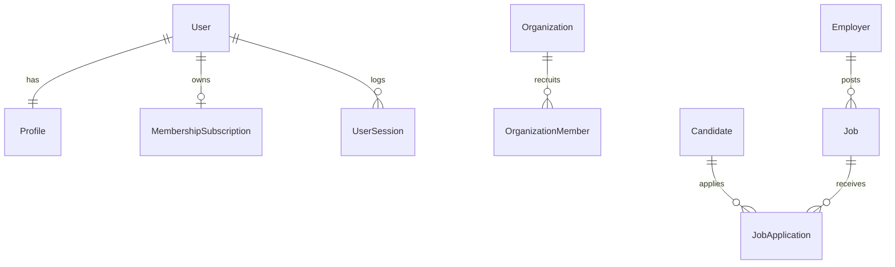

# 📘 Handbook 03 – Engineering

**Version:** 1.0  
**Owner:** Chief Architect / Tech Leads  
**Scope:** Monorepo Workspaces, Database Architecture, REST APIs, and Task Library  

---

## 4.1 Monorepo Workspace Boundaries

JovianeX organizes its modules into a standard monorepo structure managed by npm workspaces:

```text
JovianeX/
├── apps/
│   ├── api/          # NestJS backend server application
│   ├── web/          # Next.js customer panels dashboard
│   └── public-portal/# Next.js landing page site
└── packages/
    ├── database/     # Prisma client and seeder config files
    ├── shared/       # Shared business logic scripts
    └── ui/           # Shared brand CSS custom web elements
```

*Shared packages are linked internally, permitting atomic updates without publishing to public npm packages.*

---

## 4.2 Database Schema & Architecture

The database is built on **PostgreSQL 15-alpine**, managed via **Prisma ORM**.

### Core Entity Schema Relationships



### Table Mappings (`@@map`)
Entities explicitly map to lower snake-case SQL tables:
* `User` ──► `users`
* `Profile` ──► `profiles`
* `Lead` ──► `crm_leads`
* `Customer` ──► `crm_customers`
* `Job` ──► `jobs`
* `MembershipSubscription` ──► `membership_subscriptions`

---

## 4.3 REST API Contracts (v1)

All endpoints output standardized JSON structures:
`{ "success": boolean, "data": any, "error": { "message": string, "code": string } | null }`

### 🔑 Identity & Auth Gateway
* `POST /api/v1/auth/register` - SSO user signup validations.
* `POST /api/v1/auth/login` - Validates credentials, signs JWT, sets HttpOnly cookie.
* `GET /api/v1/auth/sessions` - Returns active device sessions array log.

### 💳 Stripe & Membership Billing
* `POST /api/v1/payments/checkout` - Returns Stripe session AED url (adds 5% VAT if location = AE).
* `POST /api/v1/payments/webhook` - Handles Stripe payment callbacks.

### 🤖 AI Conversational Gateway
* `POST /api/v1/ai/chat` - Protected chat gateway (stores history FIFO lists to Redis cache).

### 👨‍💻 Career Catalog & ATS matching
* `POST /api/v1/jobs/:id/duplicate` - Duplicates recruiter posting into `DRAFT` status.
* `GET /api/v1/ats/score/:id` - Calculates skills required-candidate intersections.

### 📈 CRM Sales Pipelines
* `POST /api/v1/crm/leads` - Creates sales leads.
* `GET /api/v1/crm/dashboard/stats` - Compiles counts and lifetime value statistics.

---

## 4.4 AI Routing & Intent Resolving

* **Capability registry router method:**
  - AI service regex-scans incoming natural language prompts.
  - Returns target capabilities tokens mapping permissions:
    - Keywords `["jobs", "resume"]` ──► `career:jobs:view`
    - Keywords `["bill", "invoice"]` ──► `finance:invoices:view`

---

## 4.5 Master Task Library Registries

All engineering tasks follow standardized metadata cards and are tracked strictly by ID code mappings:

### Core Platform Catalog (`CORE-*`)
- `CORE-001`: Initialize Repository (Git flow, initial commit).
- `CORE-002`: Monorepo Workspaces Configuration (yarn/npm workspaces).
- `CORE-006`: Docker Compose Orchestration (Postgres/Redis services definition).
- `CORE-015`: NestJS Server Bootstrapping setup.

### Identity Catalog (`AUTH-*`)
- `AUTH-006`: SSO Signup OTP email dispatching.
- `AUTH-007`: JWT login secure cookies handling.

### Membership & Billing Catalog (`BILL-*`)
- `BILL-001`: Dynamic Stripe checkout session + 5% UAE VAT calculations.
- `BILL-002`: NestJS Subscription Guard (`SubscriptionGuard`) integrations.

### AI Gateway Catalog (`AIA-*`)
- `AIA-001`: Gated chat route with Redis history caching list.
- `AIA-002`: Prompt intent classification capability router.

### Recruitment Catalog (`ATS-*`)
- `ATS-001`: Recruiter catalog deep copy job duplication method.
- `ATS-002`: Case-insensitive skills intersection matching score.

### CRM Pipelines Catalog (`CRM-*`)
- `CRM-001`: Lead entity table mapping.
- `CRM-002`: Customer entity relation links.
- `CRM-003`: Lead CRUD validation controllers.
- `CRM-004`: Customer CRUD validation controllers.
- `CRM-005`: Dashboard stats counts and aggregates LTV.
